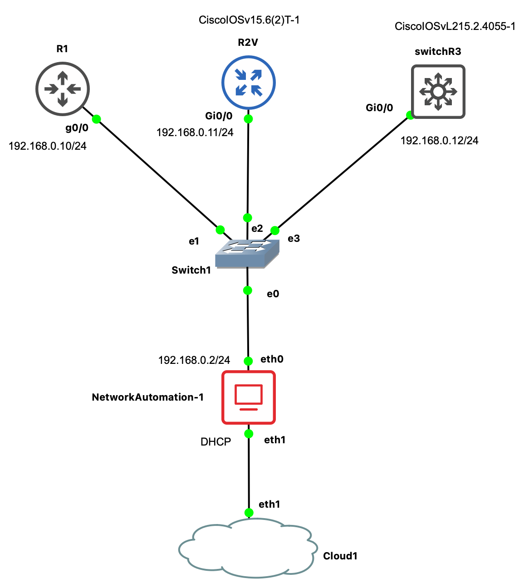

# Ansible_in_GNS3-_An_Intro

<!---

-->


## Network Automation
Network Automation is a docker system with linux and Ansible installed. The GNS3 appliance is in [https://www.redhat.com/en/topics/automation/what-is-yaml](https://www.gns3.com/marketplace/labs/network-automation-3)

The network interfaces are configured as follows:

```
#
# This is a sample network config, please uncomment lines to configure the network
#

# Uncomment this line to load custom interface files
# source /etc/network/interfaces.d/*

# Static config for eth0
auto eth0
iface eth0 inet static
	address 192.168.0.2
	netmask 255.255.255.0
#	gateway 192.168.0.1
#	up echo nameserver 192.168.0.1 > /etc/resolv.conf

# DHCP config for eth0
#auto eth0
#iface eth0 inet dhcp
#	hostname NetworkAutomation-1

# Static config for eth1
#auto eth1
#iface eth1 inet static
#	address 192.168.1.2
#	netmask 255.255.255.0
#	gateway 192.168.1.1
#	up echo nameserver 192.168.1.1 > /etc/resolv.conf

# DHCP config for eth1
auto eth1
iface eth1 inet dhcp
#	hostname NetworkAutomation-1
```
The template configuration of the machine has to show 2 adapters, one pointing to the network and the other to the cloud which allow to ping *outside*.

#### The file `/etc/hosts` content:
```
192.168.0.10 R1
192.168.0.11 R2V
192.168.0.12 switchR3
```
We do not use DNS and the `hosts` file will allow us to PING each connected IP by using their `hostname`.

#### The file `/etc/ssh/ssh_config`
Append at the end the following:

```
KexAlgorithms=curve25519-sha256@libssh.org,ecdh-sha2-nistp256,ecdh-sha2-nistp384,ecdh-sha2-nistp521,diffie-hellman-group-exchange-sha256,diffie-hellman-group14-sha1,diffie-hellman-group1-sha1

Ciphers aes128-ctr,aes192-ctr,aes256-ctr,aes128-cbc,3des-cbc
```
#### The file `/etc/ansible/ansible.cfg`
In the `paramiko_connection` section of the file add the following line:
```
[paramiko_connection]
host_key_auto_add = True
```

## R1 router
R1 is a Cisco 7200 (*c7200-adventerprisek9-mz.124-24.T5.image*)

Configuration through CLI:
```
conf t
int gi0/0
ip add 192.168.0.10 255.255.255.0
no sh
end
wr

conf t
ip domain.name domain.local
username ansible privilege 15 secret ansible

line vty 0 15
login local
exit

enable secret cisco
line console 0
passw cisco
login 
exit

end
write memory
```
Check if `ssh` will works:
```
show ip ssh
```
ssh activation:
```
R1(config)#ssh time-out 60
R1(config)#crypto key generate rsa usage-keys label router-key
```
The CLI will ask for the size of the key.
The key should have `1024 bits`. Thus, we answer both questions with `1024`.

## Connection to R1
1. Check R1 is reachable from Ansible host, e.g., PING to `192.168.0.10`.
2. Then make the `ssh` connection: `ssh ansible@192.168.0.10`

That should open an ssh connection to R1. If not, take a second look to the steps above. Also, can the following could be tested: `ssh -oHostKeyAlgorithms=ssh-rsa ansible@192.168.0.10`.


## R2V router
This a vIOS router. The configuration is as follows:
```
conf t
hostname R2V
int gi0/0
ip add 192.168.0.11 255.255.255.0
no sh
end
wr

conf t
ip domain-name domain.local
username ansible privilege 15 secret ansible

line vty 0 15
login local
transport input all
exit

enable secret cisco
line console 0
passw cisco
login 
exit

end
write memory
```

Besides, we must set the keys in the router:
```
R2V(config)#ip ssh time-out 60

R2V(config)#crypto key generate rsa usage-keys label router-key
```
and answer 1024 to the two configuration questions that shows on.


## switchR3 multilayer (L2/L3) switch
Also vIOS. We would configure it as a router.

```
conf t
hostname switchR3
end
sh int desc


configure terminal
 ip routing
 interface g0/0
 no switchport
 ip address 192.168.0.12 255.255.255.0 S
 no shutdown
 end


conf t
ip domain name domain.local
username ansible privilege 15 secret ansible

line vty 0 15
login local
transport input all
exit

enable secret cisco
line console 0
passw cisco
login 
exit

end
write memory
```

Besides, we must set the keys in the router:
```
switchR3(config)#ip ssh time-out 60

switchR3(config)#crypto key generate rsa usage-keys label router-key
```
and answer 1024 to the two configuration questions that shows on.


## Ansible inventory and playbook files

The inventory file contains the groups of nodes we have to configure.
```
[routers]
R1
R2V

[switches]
switchR3
```
We are calling `ansible_hosts` to the inventory file.

A playbook file contains the instructions to Ansible and the commands to run in the remote nodes.
The instrucions follow the [YAML](https://www.redhat.com/en/topics/automation/what-is-yaml) format.

Playbook `int_g10R1.yml`:
```
---
- name: Configure Interface G1/0 on Router R1
  hosts: R1
  gather_facts: false
  connection: local

  tasks:
    - name: Obtain Login Information
      include_vars: secrets.yml

    - name: Define Provider
      set_fact:
        provider:
          host: "{{ ansible_host }}"
          username: "{{ creds['username'] }}"
          password: "{{ creds['password'] }}"
          auth_pass: "{{ creds['auth_pass'] }}"
          timeout: 60

    - name: Configure Interface G1/0
      ios_command:
        provider: "{{ provider }}"
        commands:
          - configure terminal
          - interface GigabitEthernet1/0
          - ip address 192.168.2.10 255.255.255.0
          - no shutdown
          - end
          - wr
      register: if_data
    - debug:
        var: if_data['stdout_lines'][0]
```

1. Name and Hosts Section:
```
- name: Configure Interface G1/0 on Router R1
  hosts: R1
  gather_facts: false
  connection: local
```
* `name`: Descriptive name for the playbook.
* `hosts`: Specifies the target host or group of hosts. In this case, it's the host group named R1.
* `gather_facts`: Disables gathering facts for the local machine (the Ansible control machine).
* `connection: local`: Specifies that the playbook should run locally on the Ansible control machine.

2. Tasks Section:
```
tasks:
  - name: Obtain Login Information
    include_vars: secrets.yml
```
* `include_vars`: Loads variables from an external file (secrets.yml in this case) that contains login information like usernames and passwords.
```
  - name: Define Provider
    set_fact:
      provider:
        host: "{{ ansible_host }}"
        username: "{{ creds['username'] }}"
        password: "{{ creds['password'] }}"
        auth_pass: "{{ creds['auth_pass'] }}"
        timeout: 60
```
* `set_fact`: Sets a variable named provider with connection details. The `provider variable is then used in subsequent tasks.

```
  - name: Configure Interface G1/0
    ios_command:
      provider: "{{ provider }}"
      commands:
        - configure terminal
        - interface GigabitEthernet1/0
        - ip address 192.168.2.10 255.255.255.0
        - no shutdown
        - end
        - wr
    register: if_data
```

* `ios_command`: Sends a series of IOS commands to the router for configuration.
* The `commands` section includes the sequence of commands you would typically enter in the IOS command-line interface (CLI) to configure an interface (`GigabitEthernet1/0` in this case).
* `register`: Captures the output of the commands in a variable named if_data.
```
    - debug:
      var: if_data['stdout_lines'][0]
```

* `debug`: Prints the output of the executed commands for verification purposes. The [0] index is used to access the first line of the output.

## Running the Ansible playbook

It uses the following format:
```
ansible-playbook -i ansible_hosts int_g10R1.yml.yml
```

We pass the inventory file with the `-i` parameter and the playbook file.


