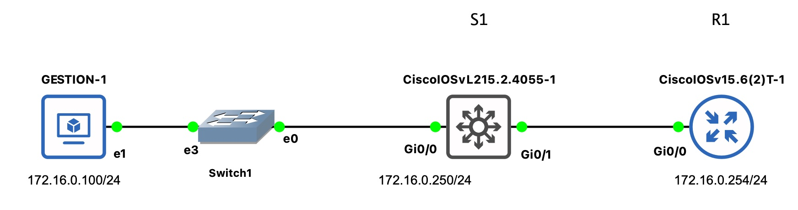

# Using GESTION Virtual Machine

> GESTION or CentOS is the MV used in the Lab classes and it has Python 2.4.3 installed.

> Therefore, the scripts has slight adjustements, such as the **b** prefix in the `tn.write` statements.

> These example scripts also change the IPs used and adapt them to the GESTION subnet: `172.16.0.100/24`
  - **Note:** For example, the initial `R1` and `S1` setup uses IPs of the figure:
    - R1: `172.16.0.254/24` (GW of GESTION)
    - S1: `172.16.0.250/24`
