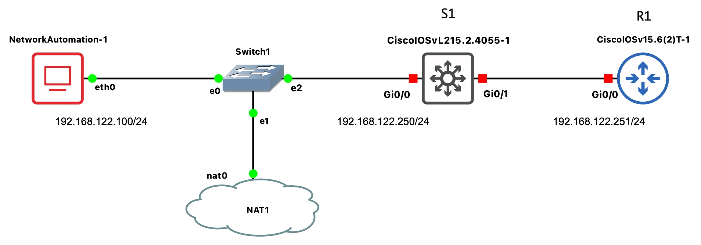

# Intro to Network Automation with Python
This lab goal is to use Python code to make basic configurations of network nodes. The [telnetlib](https://docs.python.org/3/library/telnetlib.html) library serves to open a Telnet session and send configuration commands to remote nodes.

<!---



-->

<!---
## Automation station
Network Automation is a docker system with linux and Python installed. The GNS3 appliance is in [Network Automation link](https://gns3.com/marketplace/appliances/network-automation).


The network interfaces are configured as follows:
```
#
# This is a sample network config uncomment lines to configure the network
#
# Static config for eth0
# auto eth0
# iface eth0 inet static
#	address 192.168.0.2
#	netmask 255.255.255.0
#	gateway 192.168.0.1
#	up echo nameserver 192.168.0.1 > /etc/resolv.conf
# DHCP config for eth0
 auto eth0
 iface eth0 inet dhcp
```

1. Copy this lines with the Automation station stopped.
2. Start the node (*Play*). It will catch an IP from the localhost via DHCP
   
   **Note:** this IP is important because we will configure R1 in the same subnet
4. Make a PING to Internet (e.g., 8.8.8.8)
5. Make `apt-get update` to update references in Ubuntu
6. Install Python: `apt-get install python` (if prompted say 'yes' or `Y`')
-->

## GNS3 topology


1. Open MV used in GdR labs
2. Open GNS3 program
3. Configure the above network. Note that the cloud node is the gateway to the localhost (a.k.a. MV Fedora)
4. Now start the two nodes, multilayer switch S1 and the router R1. These nodes have _heavy_ IOS that can load considerably the CPU, at least at startup. Once started (afte ~3min) the CPU load should be lower.
5. Open a `Console` in both nodes and _click_ the Enter key until you can see the prompt, `Router>` or `Switch>`


## R1 configuration
1. Open a console at R1 and set an IP address like follows

```
conf t
hostname R1 
enable password cisco
username plm password cisco

int g0/0
ip add 172.18.0.251 255.255.255.0
no sh
exit
line vty 0 4
login local
transport input all
end

write
```

2. The line `transport input all` is required to be able to stablish Telnet and SSH connections. The user and password (`plm` and `cisco`) could be personalized.
3. `R1#show ip int brief` 
4. Now, is it possible to test the telnet connection to R1 from the localhost Terminal:
   ```
   root@NetworkAutomation-1:~#telnet 172.18.0.251
   Username: plm
   password: 
   ```
   write `cisco` in the password.
   
   To enter in protected mode (`enable`) the password we have set is `cisco`.

## Basic Python script

Using the `telnetlib` library we can stablish a Telnet session with **R1**

The network automation station has no WYSIWYG editor. We can use the `vi` or the `nano` Terminal editors to write the Python program.

**Note:** The following examples must be run with **python3** (Python version 3). There are slight differences between version 2 and 3. 
For example, `input` in v2 is `raw_input`, 
and, strings are already sequences of bytes, so there's no need to explicitly encode them. Hence, you don't see the **b** prefix before string literals in Python 2 when working with telnetlib. The folder *Py_v2* contains the Python 2 version of the scripts.

#### basic.py

To make Telnet to R1 and configure interface `Loopback 0`, (l0).

```
# basicR1.py
import getpass
import telnetlib

HOST = "192.168.122.251"
user = input("Enter your telnet username:")
password = getpass.getpass()

tn = telnetlib.Telnet(HOST)

tn.read_until(b"Username: ")
tn.write(user.encode('ascii') + b"\n")
if password:
    tn.read_until(b"Password: ")
    tn.write(password.encode('ascii') + b"\n")

tn.write(b"enable\n")
tn.write(b"cisco\n")

tn.write(b"conf t\n")
tn.write(b"int l0\n")
tn.write(b"ip add 1.1.1.1 255.255.255.255\n")
tn.write(b"end\n")
tn.write(b"sh ip int brief\n")
tn.write(b"exit\n")
tn.write(b"write\n")

print(tn.read_all().decode('ascii'))
```

The `telnetlib` documentation is very explicit about wanting "byte strings"; thats is why the string must be encoded (the `b` letter in the script. 
<!---
Regular Python 3 strings are multi-byte character strings without an explicit encoding attached; to make byte strings of them means either rendering them down, or generating them as pre-rendered bytestring literals.
-->

**Note:** Python language does not use separations such us curly braquets, instead it uses **identation**.

**Running the R1 script:**
```
root@NetworkAutomation-1:~#python3 basicR1.py
```

After that, we could check that the `l0` interface has been configured. In the R1 console:

```
R1#sh ip int brief
```

We could add lines

```
tn.write(b"int l1\n")
tn.write(b"ip add 2.2.2.2 255.255.255.255\n")
tn.write(b"router ospf 1\n")
tn.write(b"network 0.0.0.0 255.255.255.255 area0\n")
```

to the `bassicR1.py` script and configure a second loopback interface, and OSPF, like 
we have in the script `scr1.py` that will be tested later.
