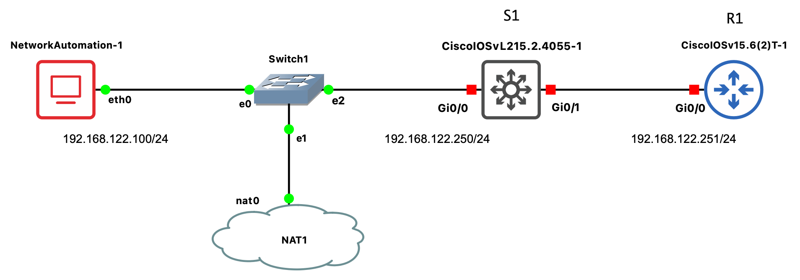

# Intro to Network Automation with Python
This lab aims to use Python programs to make a basic configuration of network nodes. The [telnetlib](https://docs.python.org/3/library/telnetlib.html) library serves to open a Telnet session and send configuration commands to the remote node.

<!---

-->


## Automation station
Network Automation is a docker system with linux and Python installed. The GNS3 appliance is in [Network Automation link](https://gns3.com/marketplace/appliances/network-automation).

The network interfaces are configured as follows:
```
#
# This is a sample network config uncomment lines to configure the network
#
# Static config for eth0
#auto eth0
#iface eth0 inet static
#	address 192.168.0.2
#	netmask 255.255.255.0
#	gateway 192.168.0.1
#	up echo nameserver 192.168.0.1 > /etc/resolv.conf
# DHCP config for eth0
 auto eth0
 iface eth0 inet dhcp
```

1. Copy this lines with the Automation station stopped.
2. Start the node (*Play*). It will catch an IP from the localhost via DHCP
   
   **Note:** this IP is important because we will configure R1 in the same subnet
4. Make a PING to Internet (e.g., 8.8.8.8)
5. Make `apt-get update` to update references in Ubuntu
6. Install Python: `apt-get install python` (if prompted say 'yes' or `Y`')

Now start the two nodes, multilayer switch S1 and the router R1.

## R1 configuration
1. Open a console at R1 and set an IP address like follows

```
conf t
hostanme R1 
enable password cisco
username plm password cisco

int g0/0
ip add 192.168.122.251 255.255.255.0
no sh
exit
line vty 0 4
login local
transport input all
end

write
```

2. The line `transport input all` is required to be able to stablish Telnet and SSH connections. The user and password (`plm` and `cisco`) could be personalized.
3. `R1#show ip int brief` 
4. Now, is it possible to test the telnet connection to R1 from the automation station Terminal:
   ```
   root@NetworkAutomation-1:~#telnet 192.168.122.251
   Username: plm
   password: 
   ```
   write `cisco` in the password.
   
   To enter in protected mode (`enable`) the password we have set is `cisco`.

## Basic Python script

Using the `telnetlib` library we can stablish a Telnet session with **R1**

The network automation station has no WYSIWYG editor. We can use the `vi` or the `nano` Terminal editors to write the Python program.

#### basic.py

To make Telnet to R1 and configure interface `Loopback 0`, (l0).

```
# basicR1.py
import getpass
import telnetlib

HOST = "192.168.122.251"
user = input("Enter your telnet username:")
password = getpass.getpass()

tn = telnetlib.Telnet(HOST)

tn.read_until(b"Username: ")
tn.write(user.encode('ascii') + b"\n")
if password:
    tn.read_until(b"Password: ")
    tn.write(password.encode('ascii') + b"\n")

tn.write(b"enable\n")
tn.write(b"cisco\n")

tn.write(b"conf t\n")
tn.write(b"int l0\n")
tn.write(b"ip add 1.1.1.1 255.255.255.255\n")
tn.write(b"end\n")
tn.write(b"sh ip int brief\n")
tn.write(b"exit\n")
tn.write(b"write\n")

print(tn.read_all().decode('ascii'))
```

The `telnetlib` documentation is very explicit about wanting "byte strings"; thats is why the string must be encoded (the `b` letter in the script. 
<!---
Regular Python 3 strings are multi-byte character strings without an explicit encoding attached; to make byte strings of them means either rendering them down, or generating them as pre-rendered bytestring literals.
-->

**Running the R1 script:**
```
root@NetworkAutomation-1:~#python3 basicR1.py
```


**Note:** Python language does not use separations such us curly braquets, instead it uses **identation**.


## S1 configuration
S1 is an IOSv Cisco switch that can be configured remotely with SSH or Telnet.
1. Open a console to S1 and make a basic IP configuration.

```
enable
conf t
int vlan 1
ip add 192.168.122.250 255.255.255.0
no sh
exit

host S1
enable password cisco
username plm password cisco

line vty 0 4
login local
transport input all
end

write
```

2. Test the network with a PING from the Network Automation station:
   `ping 192.168.122.250`
3. Make a Telnet:
   `telnet 192.168.122.250`
4. Run some CLI commands:
   ```
   sh vlan brief
   sh ip int brief
   ```


#### Basic S1 script

1. In the S1 console, run  `show vlan`

which must show only the `vlan 1` configured before in the CLI.

2. Using any Terminal editor create the `basicS1.py` script:
   
```
# Basic S1 script
import getpass
import telnetlib

HOST = "192.168.122.250"
user = input("Enter your telnet username: ")
password = getpass.getpass()

tn = telnetlib.Telnet(HOST)

tn.read_until(b"Username: ")
tn.write(user.encode('ascii') + b"\n")
if password:
    tn.read_until(b"Password: ")
    tn.write(password.encode('ascii') + b"\n")

tn.write(b"enable\n")
tn.write(b"cisco\n")

tn.write(b"conf t\n")
tn.write(b"vlan 2\n")
tn.write(b"name Python_vlan_2\n")
# tn.write(b"vlan 3\n")
# tn.write(b"name Python_vlan_3\n")
# tn.write(b"vlan 4\n")
# tn.write(b"name Python_vlan_4\n")
# tn.write(b"vlan 5\n")
# tn.write(b"name Python_vlan_5\n")
# tn.write(b"vlan 6\n")
# tn.write(b"name Python_vlan_6\n")
tn.write(b"exit\n")
tn.write(b"end\n")
tn.write(b"exit\n")
tn.write(b"write\n")

print(tn.read_all().decode('ascii'))
```

Uncomment the lines with `#` to configure more than one vlan.

3. Make `sh vlan` in the S1 console to check the vlan 2 is configured

**Running the S1 script:**
```
root@NetworkAutomation-1:~#python3 basicS1.py
```


**The power of Python programming to configure a network comes clear when repeated instructions can be coded with loops.**

* Review the code in the Python scripts: `scr1.py` and `scr2.py`.
* Test these scripts to configure multiple Loopback interfaces in R1, and vlans in S1.

**Finally**, is it possible to create a file with common data required in a script, then read it into the Python script and load these data in variables used. For example, the file `data.cfg` has the two IPs of the nodes we want to configure, and two lines with the user and password. 

```
192.168.122.250
192.168.122.251
plm
cisco
```

and the Python to read this file:


