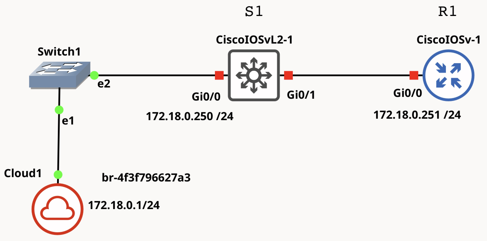

# Intro to Network Automation with Python
This lab goal is to use Python code to make basic configurations of network nodes. The [telnetlib](https://docs.python.org/3/library/telnetlib.html) library serves to open a Telnet session and send configuration commands to remote nodes.

<!---



-->


## GNS3 topology


1. Open MV used in GdR labs
2. Open GNS3 program
3. Configure the above network. Note that the cloud node is the gateway to the localhost (a.k.a. MV Fedora)
4. Now start the two nodes, multilayer switch S1 and the router R1. These nodes use _heavy_ IOS (IOSv) that can load considerably the CPU, at least at startup. Once started (afte ~3min) the CPU load should be lower.
5. Open a `Console` in both nodes and _click_ the Enter key until you can see the prompt, `Router>` or `Switch>`


## R1 configuration
1. Open a console at R1 and set an IP address like follows

```
enable
conf t
hostname R1 
enable password cisco
username plm password cisco

int g0/0
ip add 172.18.0.251 255.255.255.0
no sh
exit
line vty 0 4
login local
transport input all
end

write
```

2. The line `transport input all` is required to be able to stablish Telnet and SSH connections. The user and password (`plm` and `cisco`) can be personalized.
3. `R1#show ip int brief`
4. From the localhost Terminal do `lab@fedora:~$ ping 172.18.0.251`. 
5. Now, is it possible to test the telnet connection to R1 from the localhost Terminal:
   ```
   lab@fedora:~$ telnet 172.18.0.251
   Username: plm
   password: 
   ```
   write `cisco` in the password.
   
   To enter in protected mode (`enable`) the password we have set is `cisco`.


## Basic Python script

Using the `telnetlib` library we can stablish a Telnet session with **R1**

Fedora localhost has the `gedit` editor (Applications>Accessories>gedit). We can use the `vim` or the `nano` editors that run in the Terminal to write the Python program.

**Note:** The following examples must be run with **python3** (Python version 3) which is the default version in your system.  There are slight differences between version 2 and 3. 
For example, `input` in v2 is `raw_input`, 
and, strings are already sequences of bytes, so there's no need to explicitly encode them. Hence, you don't see the **b** prefix before string literals in Python 2 when working with telnetlib. The folder *Py_v2* contains the Python 2 version of the scripts.

To develop Python code it is recommended to create a separated Python environment. We have already one that can be used in this lab. To enter the environment do

```
lab@fedora:~$ workon gns3
```
the prompt changes to `(gns3) lab@fedora:~$` which indicates we are using the Python environment named `gns3`. All packages that we could install or use coding Python will remain in this environment and will not affect the Global Python environment. 

Also, it is advisable to create a new folder (e.g. named _py_scripts
_) in the localhost to save the scripts.


#### basicR1.py

To make Telnet to R1 and configure interface `Loopback 0`, (l0).

```
#!/home/lab/.virtualenvs/gns3/bin/python -W ignore

# basicR1.py
import getpass
import telnetlib


HOST = "172.18.0.251"
user = input("Enter your telnet username:")
password = getpass.getpass()

tn = telnetlib.Telnet(HOST)

tn.read_until(b"Username: ")
tn.write(user.encode('ascii') + b"\n")
if password:
    tn.read_until(b"Password: ")
    tn.write(password.encode('ascii') + b"\n")

tn.write(b"enable\n")
tn.write(b"cisco\n")

tn.write(b"conf t\n")
tn.write(b"int l0\n")
tn.write(b"ip add 1.1.1.1 255.255.255.255\n")
tn.write(b"end\n")
tn.write(b"sh ip int brief\n")
tn.write(b"exit\n")
tn.write(b"write\n")

print(tn.read_all().decode('ascii'))
```
Python is an intepreted language which means it does not require an explicit compilation like with C or C++. 

**Note:** 
* Python does nos use curly braces to enclose loop lines or conditional statements, instead uses **identation**, _i.e._ some space to start the code in the statement, like in 
```
if password:
    tn.read_until(b"Password: ")
    tn.write(password.encode('ascii') + b"\n")
```
* The line starting with `#!` is to indicate the Python interpreter location.

The `telnetlib` documentation is very explicit about wanting "byte strings"; thats is why the string must be encoded (the `b` letter in the script. 
<!---
Regular Python 3 strings are multi-byte character strings without an explicit encoding attached; to make byte strings of them means either rendering them down, or generating them as pre-rendered bytestring literals.
-->


**Running the R1 script:**
1. Make the script executable
   ```
   (gns3) lab@fedora:~/py_scripts$ chmod +x basicR1.py
   ```
2. Run the script
```
(gns3) lab@fedora:~/py_scripts$ ./basicR1.py 
```

After that, we could check that the `l0` interface has been configured. In the R1 console:

```
R1#sh ip int brief
```

We could add lines

```
tn.write(b"int l1\n")
tn.write(b"ip add 2.2.2.2 255.255.255.255\n")
tn.write(b"router ospf 1\n")
tn.write(b"network 0.0.0.0 255.255.255.255 area0\n")
```

to the `basicR1.py` script and configure a second loopback interface, and OSPF, like 
we have in the script `scr1.py` that will be tested later.


## S1 configuration
S1 is an IOSv Cisco switch that can be configured remotely with SSH or Telnet.
1. Open a console to S1 and make a basic IP configuration.

```
enable
conf t
int vlan 1
ip add 172.18.0.250 255.255.255.0
no sh
exit

host S1
enable password cisco
username plm password cisco

line vty 0 4
login local
transport input all
end

write
```

2. Test the network with a PING from the Network Automation station:
   `ping 172.18.0.250`
3. Make a Telnet:
   `telnet 172.18.0
   .250`
5. Run some CLI commands:
   ```
   sh vlan brief
   sh ip int brief
   ```


#### Basic S1 script

1. In the S1 console, run  `show vlan`

which must show only the `vlan 1` configured before in the CLI.

2. Using any Terminal editor create the `basicS1.py` script:
   
```
#!/home/lab/.virtualenvs/gns3/bin/python -W ignore
# Basic S1 script
import getpass
import telnetlib

HOST = "172.18.0.250"
user = input("Enter your telnet username: ")
password = getpass.getpass()

tn = telnetlib.Telnet(HOST)

tn.read_until(b"Username: ")
tn.write(user.encode('ascii') + b"\n")
if password:
    tn.read_until(b"Password: ")
    tn.write(password.encode('ascii') + b"\n")

tn.write(b"enable\n")
tn.write(b"cisco\n")

tn.write(b"conf t\n")
tn.write(b"vlan 2\n")
tn.write(b"name Python_vlan_2\n")
# tn.write(b"vlan 3\n")
# tn.write(b"name Python_vlan_3\n")
# tn.write(b"vlan 4\n")
# tn.write(b"name Python_vlan_4\n")
# tn.write(b"vlan 5\n")
# tn.write(b"name Python_vlan_5\n")
# tn.write(b"vlan 6\n")
# tn.write(b"name Python_vlan_6\n")
tn.write(b"exit\n")
tn.write(b"end\n")
tn.write(b"exit\n")
tn.write(b"write\n")

print(tn.read_all().decode('ascii'))
```

Uncomment the lines with `#` to configure more than one vlan.

3. Make `sh vlan` in the S1 console to check the vlan 2 is configured

**Running the S1 script:**
1. Make the script executable
   ```
   (gns3) lab@fedora:~/py_scripts$ chmod +x basicS1.py
   ```
2. Run the script
```
(gns3) lab@fedora:~/py_scripts$ ./basicS1.py 
```


**The power of Python programming to configure a network comes clear when repeated instructions can be coded with loops.**

* Review the code in the Python scripts: `scr1.py` and `scr2.py`.
* Test these scripts to configure multiple Loopback interfaces in R1, and vlans in S1.

  Note that the Python environment is already set in the first line of these scripts and there is no need to call `python3` if they are set
  executables (`chmod +x`).
  

**Finally**, is it possible to create a file with common data required in a script, then read it into the Python script and load these data in variables declared in te code. 
For example, the file `data.cfg` has the two IPs of the nodes we want to configure, and two lines with the user and password. 

```
172.18.0.250
172.18.0.251
plm
cisco
```

and the Python to read this file:
```
with open("data.cfg") as file:
        lines = file.read().splitlines()

    user = lines[-2].strip()  # Second-to-last line
    password = lines[-1].strip()  # Last line


    ips = [ip.strip() for ip in lines[:-2]]
```
Take a look and test the scrip `scrALL.py` and test it. This file can be extended to configure different devices. 
The only caveat is how to tell what set of commands to use with each IP. 
Generalization can be done using a list of tuples [(IP,[command1,command2,..]),...] or using Python dictionary {'IP':[command1,command2,..],...}. 
This way, makes `data.cfg` only useful to gather user and password. More generally, can be the use of a single JSON or YAML file to get credentials and configurations.

