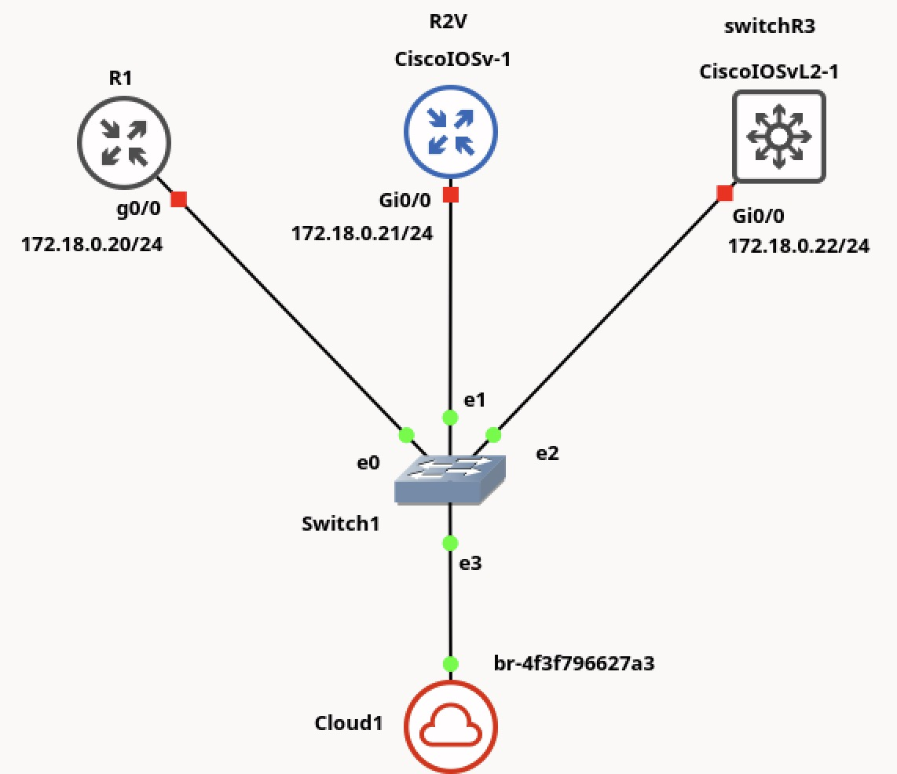

# Intro to Network Automation with Ansible

### Introduction
Ansible is an open-source automation tool used for configuration management, application deployment, and infrastructure orchestration. *It operates **without requiring agents** on the managed systems*, using SSH for Linux and WinRM for Windows. Configurations and tasks are defined in YAML files called playbooks, making it straightforward to describe system states and automate processes. Ansible follows a declarative approach, meaning users specify the desired outcome rather than the exact steps to achieve it.

The tool includes a large set of modules that support tasks such as managing cloud services, databases, and network devices. It is designed to be idempotent, applying changes only when necessary to maintain system consistency. Ansible can be used for both small-scale automation and managing complex infrastructures with thousands of nodes. It integrates with various DevOps tools, including Docker, Kubernetes, and cloud platforms like AWS, Azure, and GCP, making it suitable for a range of automation workflows.

Ansible is primarily written in Python. The core engine and most of its modules are developed in Python, making it lightweight and easily extensible. Additionally, Ansible relies on Python libraries such as paramiko for SSH connections and Jinja2 for templating.

### Installation notes on Fedora MV

We have created a Python environment to work with Ansible in the Fedora MV of this course. To access this environment just run 
```
workon ansible
```
To leave the environment use `deactivate`. 

Ansible is already installed in this environment the `pip` package manager (e.g. check the list of installed packages with `pip freeze`). Besides `ansible`, there are some packages installed needed to make _ssh_ connections with the nodes, and to run the examples contained in this repository. For example, `paramiko` and `ansible-pylibssh`.


### Example of use with GNS3
The topology we are using is as follows


